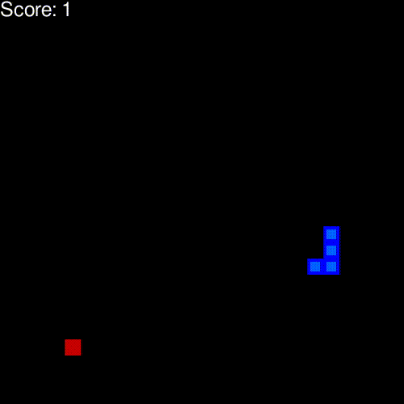
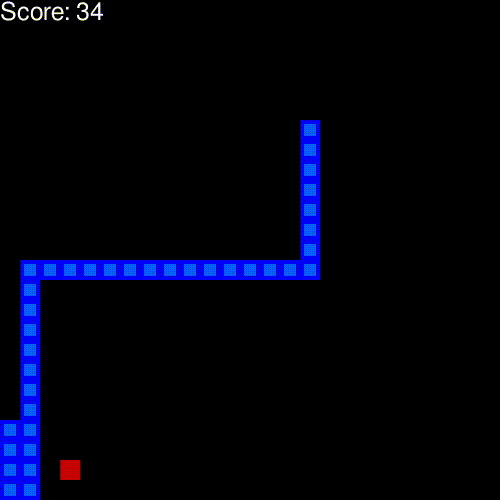

# Snake RL

Implementation of **Reinforcement learning algorithm** (Q-learning and Deep Q-learning) applied to the snake game.

The agent learns to play Snake by interacting with the environment and maximizing its score.

## How to run

```bash
git clone https://github.com/aalp75/random-generator
cd snake-reinforcement-learning
pip install -r requirements.txt
python agent.py --mode play --model qlearn
```

Arguments:
- mode: `play` or `train`
- model: `qlearn` or `deepqlearn`

Some pretrained parameters are already available if you run the agent in **play** mode.
During training, each time the agent achieves a new best score, the model parameters are automatically saved.

## Results (on a 400 x 400 grid)

Training typically requires at least 500 games.

| Model               | Record Score | Average Score |
|---------------------|--------------|---------------|
| Q-learning          | 68           | 45            |
| Deep Q-learning     | 50           | 32            |

Q-learning performs better because the state space is relatively small.
If the full game grid were used as input for the Deep Q-learning model, it would likely achieve better performance.

<table>
<tr>
<td align="center">
<b>Q-learning after 3 games</b><br>

</td>

<td align="center">
<b>Q-learning after 500 games</b><br>

</td>
</tr>
</table>

## References

<a id="1">[1]</a> 
Volodymyr Mnih, Koray Kavukcuoglu, David Silver, Alex Graves, Ioannis Antonoglou, Daan Wierstra, Martin Riedmiller (2013). Playing Atari with Deep Reinforcement Learning

